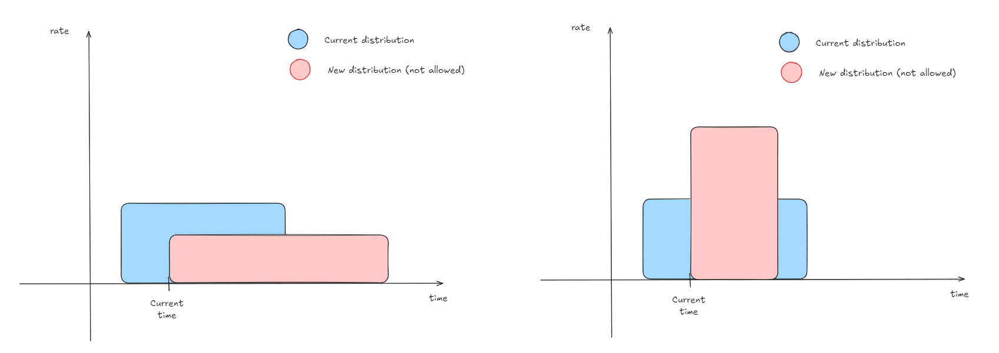
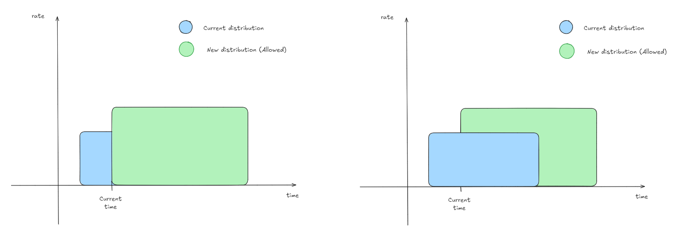
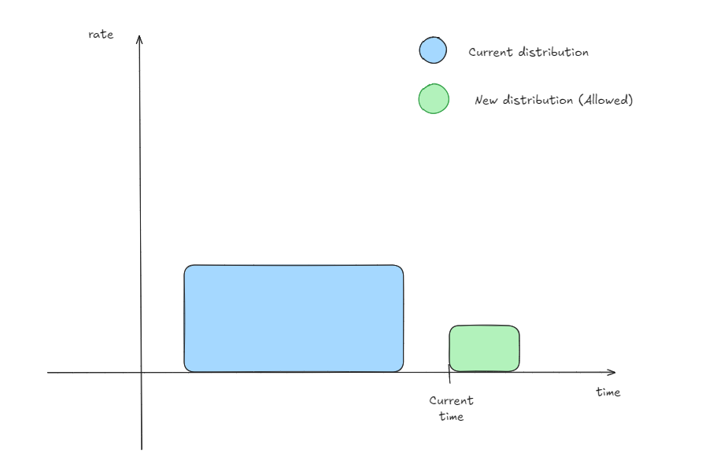

# Restricted Parameters on Deposit

## Principle

On the Curve gauges, an extra reward distribution is defined by a rate and an end of distribution. A new deposit can't reduce the current distribution rate or end time (`period_finish`).

---

## A Distribution Is Ongoing

### Unauthorized Scenarios

During a deposit, the depositor provides the `_amount` and `_epoch` parameters. With these values and the leftover of the ongoing distribution, a new rate is computed. 

- If this new rate leads to a reduction of the current rate (which also implies altering the ongoing distribution), the deposit will revert.
- Similarly, if the new `period_finish` of the distribution would be earlier than the ongoing distribution, the deposit will revert.



### Authorized Scenarios

For a deposit to be authorized, the rate and `period_finish` of the ongoing distribution must not be lowered. If these conditions are met, the depositor is allowed to deposit.



**Note:** The second graph illustrates that the ongoing distribution remains untouched, and the additional rewards contributed by the second depositor are represented by the green area.

---

## No Distribution Is Ongoing

If no distribution is ongoing, the deposit is unrestricted and follows the current extra reward implementation.



---

## Code Changes

### `Reward` Struct

The `Reward` struct no longer requires a depositor.

```diff
 struct Reward:
     token: address
-    distributor: address
     period_finish: uint256
     rate: uint256
     last_update: uint256
     integral: uint256
```

### `deposit_reward_token` Function
The `deposit_reward_token` function no longer requires a depositor. However, it must ensure that the ongoing distribution is not altered (first by checking the period_finish, then by verifying the rate).

```diff
-   assert msg.sender == self.reward_data[_reward_token].distributor
+   period_finish: uint256 = self.reward_data[_reward_token].period_finish
+   assert period_finish <= block.timestamp + _epoch , "Shortening current distribution is not allowed"

...

-   self.reward_data[_reward_token].rate = (amount_received + leftover) / _epoch
+   new_rate: uint256 = (amount_received + leftover) / _epoch
+   assert new_rate >= self.reward_data[_reward_token].rate, "Diluting current distribution is not allowed"
+   self.reward_data[_reward_token].rate = new_rate
```

### `add_reward` Function
The `add_reward` function no longer requires a depositor. Previously, the `depositor` parameter was used to check if the reward was already added; now the `token` parameter is used instead.

```diff
-   def add_reward(_reward_token: address, _distributor: address):
+   def add_reward(_reward_token: address):
        """
        @notice Add additional rewards to be distributed to stakers
        @param _reward_token The token to add as an additional reward
-       @param _distributor Address permitted to fund this contract with the reward token
        """
        assert msg.sender in [self.manager, Factory(self.factory).admin()]  # dev: only manager or factory admin
-       assert _distributor != empty(address)  # dev: distributor cannot be zero address
        reward_count: uint256 = self.reward_count
        assert reward_count < MAX_REWARDS
-       assert self.reward_data[_reward_token].distributor == empty(address)
+       assert self.reward_data[_reward_token].token == empty(address)
-       self.reward_data[_reward_token].distributor = _distributor
+       self.reward_data[_reward_token].token = _reward_token
        self.reward_tokens[reward_count] = _reward_token
        self.reward_count = reward_count + 1
```

### `set_reward_distributor` Function
The `set_reward_distributor` function has no purpose without the depositor parameter and is therefore removed.

```diff
-   @external
-   def set_reward_distributor(_reward_token: address, _distributor: address):
-       """
-       @notice Reassign the reward distributor for a reward token
-       @param _reward_token The reward token to reassign distribution rights to
-       @param _distributor The address of the new distributor
-       """
-       current_distributor: address = self.reward_data[_reward_token].distributor
-
-       assert msg.sender in [current_distributor, Factory(self.factory).admin(), self.manager]
-       assert current_distributor != empty(address)
-       assert _distributor != empty(address)
-
-       self.reward_data[_reward_token].distributor = _distributor
```